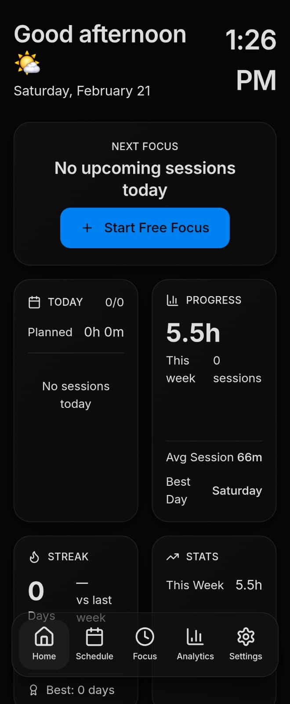
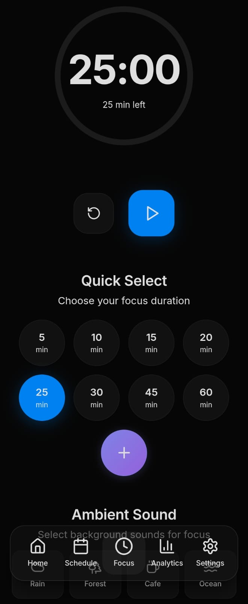
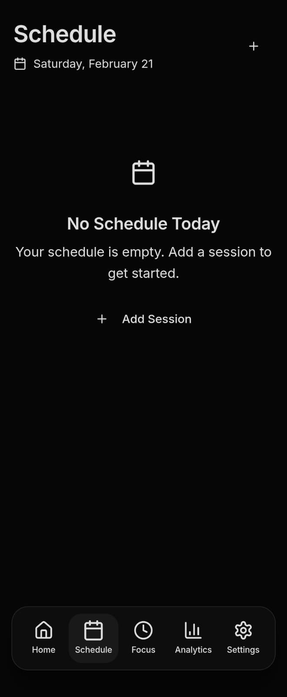
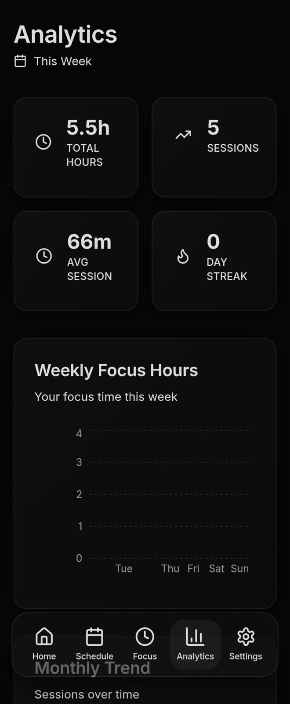

<div align="center">


# Routines

**A modern focus and productivity app for students and professionals**

[](https://github.com/Abir7109/routines/releases)
[](LICENSE)
[](https://github.com/Abir7109/routines)
[](https://nextjs.org/)
[](https://www.typescriptlang.org/)
[](https://tailwindcss.com/)

[Download APK](https://github.com/Abir7109/routines/releases/latest) · [Report Bug](https://github.com/Abir7109/routines/issues) · [Request Feature](https://github.com/Abir7109/routines/issues)

</div>

---

## Screenshots

<div align="center">




</div>

---

## About

**Routines** is a beautifully designed productivity application that helps you stay focused, manage your daily schedule, and track your progress. Built with modern technologies for a smooth, native-like experience on mobile devices.

### Why Routines?

- **Stay Focused** - Pomodoro-style timer with ambient sounds to help you concentrate
- **Manage Time** - Organize your daily schedule with subjects and time blocks
- **Track Progress** - Visualize your productivity with detailed analytics
- **Minimal Distractions** - Clean, dark-themed interface designed for focus
- **Cross-Platform** - Works on Android, iOS, and Web browsers

---

## Features

### Focus Timer
- Customizable Pomodoro timer (25/5, 50/10, or custom durations)
- Ambient sounds: Rain, Ocean, Forest, White Noise
- Pause/Resume functionality
- Focus session tracking with subject labels
- Background timer support on Android

### Schedule Management
- Create daily routines with subjects
- Set duration and time for each session
- Quick-start focus sessions from schedule
- Visual calendar view

### Analytics Dashboard
- Weekly focus time statistics
- Subject-wise time distribution
- Productivity trends and insights
- Session history tracking

### Profile & Settings
- User profile customization
- Dark/Light theme support
- Distraction blocking toggle
- Auto-start timer option
- Ambient sound preferences

---

## Tech Stack

| Category | Technology |
|----------|------------|
| **Framework** | Next.js 16 (App Router) |
| **Language** | TypeScript 5 |
| **Styling** | Tailwind CSS 4 |
| **UI Components** | shadcn/ui + Radix UI |
| **State Management** | Zustand |
| **Database** | Prisma ORM (SQLite) |
| **Mobile** | Capacitor (Android/iOS) |
| **Animations** | Framer Motion |
| **Charts** | Recharts |
| **Icons** | Lucide React |

---

## Getting Started

### Prerequisites

- Node.js 18+ or Bun
- npm, yarn, or bun package manager

### Installation

```bash
# Clone the repository
git clone https://github.com/Abir7109/routines.git

# Navigate to project directory
cd routines

# Install dependencies
npm install
# or
bun install

# Set up the database
npm run db:push

# Start development server
npm run dev
```

Open [http://localhost:3000](http://localhost:3000) to view the app.

### Build for Production

```bash
# Build Next.js app
npm run build

# Build for Android
npx cap sync android
npx cap open android

# Build for iOS
npx cap sync ios
npx cap open ios
```

---

## Project Structure

```
routines/
├── src/
│   ├── app/                    # Next.js App Router pages
│   │   ├── _api/              # API routes
│   │   ├── globals.css        # Global styles
│   │   ├── layout.tsx         # Root layout
│   │   └── page.tsx           # Main app page
│   ├── components/
│   │   ├── screens/           # Main screen components
│   │   ├── navigation/        # Navigation components
│   │   ├── functional/        # Utility components
│   │   └── ui/                # shadcn/ui components
│   ├── hooks/                 # Custom React hooks
│   └── lib/                   # Utilities and database
├── android/                   # Android native project
├── ios/                       # iOS native project
├── public/                    # Static assets
│   └── sounds/               # Ambient sound files
├── prisma/                    # Database schema
└── assets/                    # App icons and splash
```

---

## Roadmap

- [ ] Cloud sync for cross-device data
- [ ] Widget support for quick timer access
- [ ] Notification reminders for scheduled sessions
- [ ] Custom ambient sound uploads
- [ ] Focus streaks and achievements
- [ ] Team/shared focus sessions
- [ ] Apple Watch companion app

---

## Contributing

Contributions are welcome! Please feel free to submit a Pull Request.

1. Fork the repository
2. Create your feature branch (`git checkout -b feature/AmazingFeature`)
3. Commit your changes (`git commit -m 'Add some AmazingFeature'`)
4. Push to the branch (`git push origin feature/AmazingFeature`)
5. Open a Pull Request

---

## License

This project is licensed under the MIT License - see the [LICENSE](LICENSE) file for details.

---

## Acknowledgments

- [shadcn/ui](https://ui.shadcn.com/) for beautiful UI components
- [Lucide](https://lucide.dev/) for icons
- [Pexels](https://www.pexels.com/) for ambient sounds inspiration

---

<div align="center">

**Made with care by [Abir](https://github.com/Abir7109)**

If you found this project helpful, please consider giving it a star!

[](https://star-history.com/#Abir7109/routines&Date)

</div>
